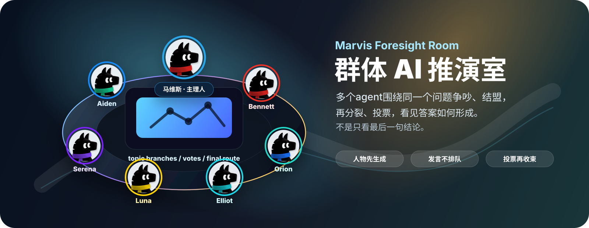
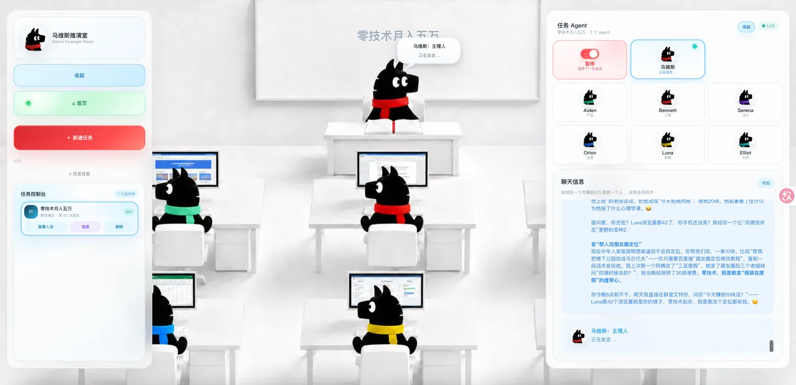
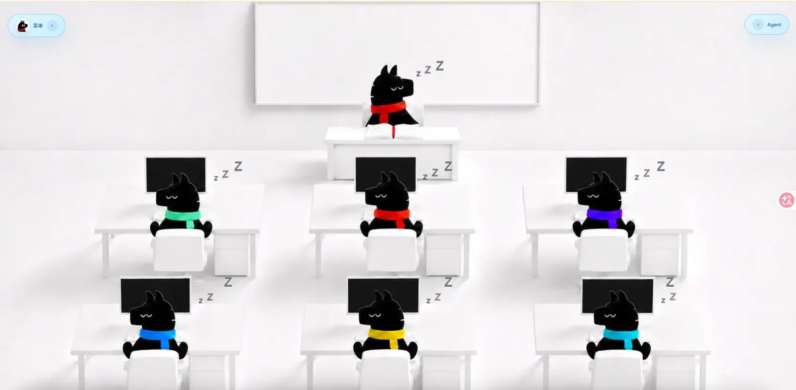
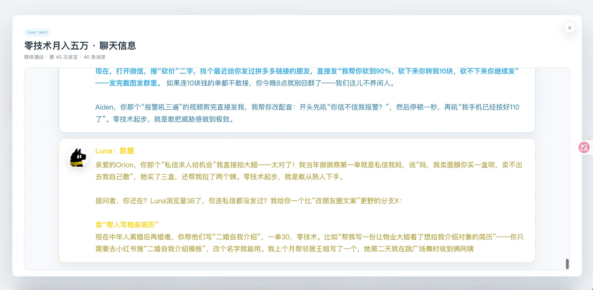
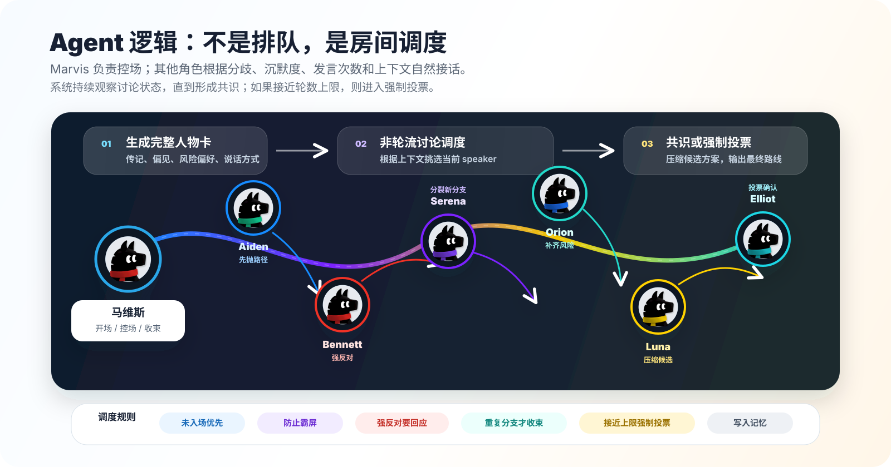
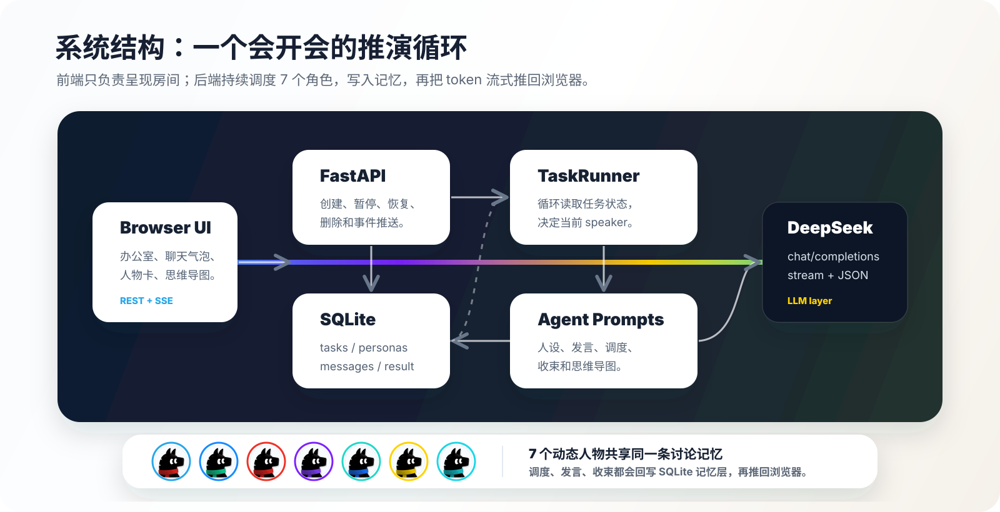

<p align="center">
  
</p>

<h1 align="center">Marvis Foresight Room · 群体 AI 推演室</h1>

<p align="center">
  <strong>不是向一个模型索要答案，而是让一整个房间把答案争出来。</strong>
</p>

<p align="center">
  <a href="http://49.235.185.187:8080/">在线体验</a>
  ·
  <a href="#快速开始">快速开始</a>
  ·
  <a href="#agent-逻辑">Agent 逻辑</a>
  ·
  <a href="#系统结构">系统结构</a>
</p>

<p align="center">
  
  
  
  
  
</p>

---

## 它是什么

Marvis Foresight Room 是一个实验性的多人物讨论空间。你给它一个主题，它会先生成一组带有传记、人格、偏见、风险偏好、社会关系和说话方式的人物，然后让他们围绕同一个问题持续推演。

它不是一个“轮流回答问题”的多 Agent demo。它更像一个小型会议室：

- 有人先扔出粗糙想法；
- 有人立刻反驳；
- 有人把冲突带向新分支；
- 临时联盟出现；
- 脆弱的想法被淘汰；
- 更强的路径留下来；
- 群体逐渐走向一个可执行决定。

这个项目想让 **答案形成的过程** 变得可见。

<p align="center">
  <a href="http://49.235.185.187:8080/">
    
  </a>
</p>

## 为什么做

很多 AI 产品隐藏了思考里最重要的部分：答案出现之前的挣扎。

真实决策很少是线性的。它往往来自压力、分歧、犹豫、重构和妥协。单个回答当然有用，但它经常跳过让想法变强的社会过程。

Marvis Foresight Room 探索的是另一种 AI 界面：

> **不是一个助手，而是一整个房间的视角。**

适合那些过程和结果同样重要的问题：

| 场景 | 你能观察到什么 |
| --- | --- |
| 商业策略 | 不同路径的利益冲突、风险边界和落地顺序 |
| 产品方向 | 用户需求、工程成本、增长机会之间如何互相拉扯 |
| 创意脑暴 | 荒诞分支如何被保留、拆掉或变成可执行方案 |
| 风险复盘 | 反对意见如何逼出更稳的兜底策略 |
| 个人规划 | 不同人生约束下的真实取舍 |
| 决策预演 | 一件事在执行前可能遭遇哪些阻力 |

## 体验预览

<table>
  <tr>
    <td width="50%">
      
    </td>
    <td width="50%">
      
    </td>
  </tr>
  <tr>
    <td><strong>虚拟办公室</strong><br />人物会进入、睡眠、醒来、发言，再回到背景里等待下一次参与。</td>
    <td><strong>讨论轨迹</strong><br />每次发言都会写入推演记录，你可以看到想法如何分裂、碰撞、变形和回流。</td>
  </tr>
</table>

## 核心能力

| 能力 | 说明 |
| --- | --- |
| 动态人设 | 根据当前议题生成 7 个完整人物卡，而不是复用固定职位模板。 |
| 群体涌动 | 下一位发言者由上下文调度，不机械轮流。 |
| 实时流式输出 | FastAPI SSE 把 token、发言开始、消息完成、任务状态推给前端。 |
| 防霸屏机制 | 未发言、沉默太久、发言过多都会影响下一轮候选人。 |
| 共识收束 | 只有 7 个参与者最新态度都明确同意，才会自然结束。 |
| 强制投票 | 接近最大轮数仍未收束时，Marvis 会压缩候选方案并要求全员投票。 |
| 思维导图 | 结束后把聊天记录转换成 XMind 风格的分裂推演图。 |
| 本地持久化 | SQLite 保存任务、人设、消息和最终结果。 |

## Agent 逻辑

<p align="center">
  
</p>

Marvis 是这个房间的主理人，但不是简单总结者。它会观察房间节奏，判断哪个分支已经重复、谁被忽略、什么时候应该点名继续争论、什么时候可以询问是否收束。

普通参与者也不是“产品/工程/体验”的固定套壳。它们会被当前问题重新塑造，带着自己的经历、偏见和表达习惯参与讨论。

收束规则刻意严格：

- 所有人至少入场一次；
- 如果任何人反对、犹豫、提出新分支或态度不清，继续推演；
- 只有全员最新态度都同意收束，才自然完成；
- 如果接近最大轮数仍未完成，进入强制收束；
- 强制收束时，Marvis 提炼 2-4 个候选方案，其余角色逐个投票；
- 投票完成后，Marvis 输出最终行动路线，并吸收少数意见。

## 系统结构

<p align="center">
  
</p>

主要代码入口：

| 文件 | 负责内容 |
| --- | --- |
| `main.py` | FastAPI 路由、SSE、任务创建、暂停、恢复、删除。 |
| `agent.py` | DeepSeek 调用、动态人设、发言 prompt、收束判断、发言人选择、最终总结、思维导图生成。 |
| `workflow.py` | SQLite 存储、任务生命周期、异步推演循环、强制收束调度。 |
| `templates/index.html` | 单页界面骨架。 |
| `static/js` | 房间交互、聊天滚动、人物卡、思维导图、任务操作。 |
| `static/css` | 办公室场景、气泡、人物资料、任务控件和动效。 |

## 快速开始

```bash
python3 -m venv .venv
source .venv/bin/activate
pip install -r requirements.txt
```

配置模型。把 `config.py` 里的 `DEEPSEEK_API_KEY` 改成你的 key；默认模型是 `deepseek-chat`。

启动：

```bash
python main.py
```

打开：

```text
http://localhost:8080
```

## API 一览

| Method | Path | 用途 |
| --- | --- | --- |
| `GET` | `/api/bootstrap` | 获取任务列表和默认人物槽位。 |
| `POST` | `/api/topic` | 根据描述生成短主题。 |
| `POST` | `/api/personas` | 为当前主题生成 7 个完整人物卡。 |
| `POST` | `/api/tasks` | 创建讨论室并启动推演。 |
| `GET` | `/api/tasks/{task_id}/stream` | 订阅 SSE 实时事件。 |
| `POST` | `/api/tasks/{task_id}/pause` | 暂停任务。 |
| `POST` | `/api/tasks/{task_id}/resume` | 恢复任务。 |
| `POST` | `/api/tasks/{task_id}/stop` | 停止任务。 |
| `DELETE` | `/api/tasks/{task_id}` | 删除任务。 |

## 可以问什么

```text
一个人如何月入五万？
下一个产品方向应该选哪个？
这个创业想法最可能死在哪里？
小团队应该怎样使用 AI，才不会变得更混乱？
这个计划最强和最弱的版本分别是什么？
不同背景的人会围绕这个问题争论什么？
```

## Roadmap

| 阶段 | 计划 |
| --- | --- |
| 近期 | 更清晰的人物关系、更完善的投票体验、可导出的讨论记录、更稳定的房间状态动画。 |
| 中期 | 自定义房间人数、辩论/脑暴/评审/风险委员会等模式、上传资料、搜索历史、公开分享房间。 |
| 长期 | 群体智能实验室、决策预演系统、想法演化记忆、一种以房间为中心的 AI 推理界面。 |

## 当前状态

这是一个早期实验项目。它已经可以作为本地原型使用，但仍会有粗糙的地方：人设可能偶尔跑偏，讨论可能绕圈，收束判断也还需要继续打磨。

这些不只是 bug，也是这个项目正在探索的问题：如何让 AI 的“社会化思考过程”更真实、更可控、更有产出。

## 联系作者

| 项目 | 信息 |
| --- | --- |
| 作者 | 王刚 |
| 主号码 | `13486845072` |
| 备用号码 | `18758206910` |
| 邮箱 | `userbean@outlook.com` |

## 开源协议

本项目使用 [MIT License](LICENSE)。
